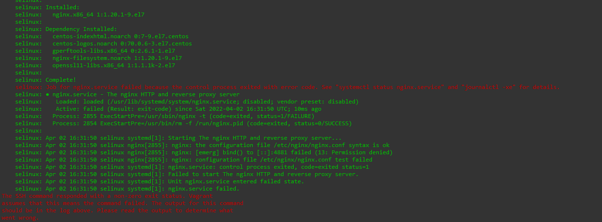

# **Введение**

В данном домашнем задании нам необходимо получить практический опыт работы с Selinux.

---

# **Подготовка и запуск окружения** 

1. Создаём файл Vagrantfile и вносим в него содержимое из методички:
```
# -*- mode: ruby -*-
# vim: set ft=ruby :

MACHINES = {
    :selinux => {
        :box_name => "centos/7",
        :box_version => "2004.01",
        #:provision => "test.sh",
    },
}

Vagrant.configure("2") do |config|
    MACHINES.each do |boxname, boxconfig|
        config.vm.define boxname do |box|
            box.vm.box = boxconfig[:box_name]
            box.vm.box_version = boxconfig[:box_version]
            box.vm.host_name = "selinux"
            box.vm.network "forwarded_port", guest: 4881, host: 4881
            box.vm.provider :virtualbox do |vb|
                vb.customize ["modifyvm", :id, "--memory", "1024"]
                needsController = false
        end
        box.vm.provision "shell", inline: <<-SHELL
            #install epel-release
            yum install -y epel-release
            #install nginx
            yum install -y nginx
            #change nginx port
            sed -ie 's/:80/:4881/g' /etc/nginx/nginx.conf
            sed -i 's/listen 80;/listen 4881;/' /etc/nginx/nginx.conf
            #disable SELinux
            #setenforce 0
            #start nginx
            systemctl start nginx
            systemctl status nginx
            #check nginx port
            ss -tlpn | grep 4881
        SHELL
        end
    end
end
```

2. После этого запускаем наш Vagrantfile.
```
dima@Test-Ubuntu-1:~/otus/my-hw11$ vagrant up
```

3. При разворачивании нашей vm видим следующие ошибки:

```
    selinux: Job for nginx.service failed because the control process exited with error code. See "systemctl status nginx.service" and "journalctl -xe" for details.
    selinux: ● nginx.service - The nginx HTTP and reverse proxy server
    selinux:    Loaded: loaded (/usr/lib/systemd/system/nginx.service; disabled; vendor preset: disabled)
    selinux:    Active: failed (Result: exit-code) since Sat 2022-04-02 16:31:50 UTC; 10ms ago
    selinux:   Process: 2855 ExecStartPre=/usr/sbin/nginx -t (code=exited, status=1/FAILURE)
    selinux:   Process: 2854 ExecStartPre=/usr/bin/rm -f /run/nginx.pid (code=exited, status=0/SUCCESS)
    selinux:
    selinux: Apr 02 16:31:50 selinux systemd[1]: Starting The nginx HTTP and reverse proxy server...
    selinux: Apr 02 16:31:50 selinux nginx[2855]: nginx: the configuration file /etc/nginx/nginx.conf syntax is ok
    selinux: Apr 02 16:31:50 selinux nginx[2855]: nginx: [emerg] bind() to [::]:4881 failed (13: Permission denied)
    selinux: Apr 02 16:31:50 selinux nginx[2855]: nginx: configuration file /etc/nginx/nginx.conf test failed
    selinux: Apr 02 16:31:50 selinux systemd[1]: nginx.service: control process exited, code=exited status=1
    selinux: Apr 02 16:31:50 selinux systemd[1]: Failed to start The nginx HTTP and reverse proxy server.
    selinux: Apr 02 16:31:50 selinux systemd[1]: Unit nginx.service entered failed state.
    selinux: Apr 02 16:31:50 selinux systemd[1]: nginx.service failed.
```

4. Далее заходим в vm и пытаемся исправить ошибку и запустить nginx.
```
dima@Test-Ubuntu-1:~/otus/my-hw11$ vagrant ssh
[vagrant@selinux ~]$ sudo -i
```
---

# **Запуск nginx на нестандартном порту 3-мя разными способами** 


